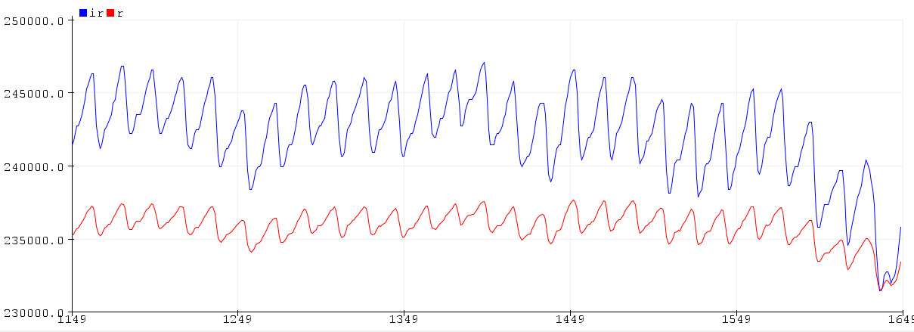
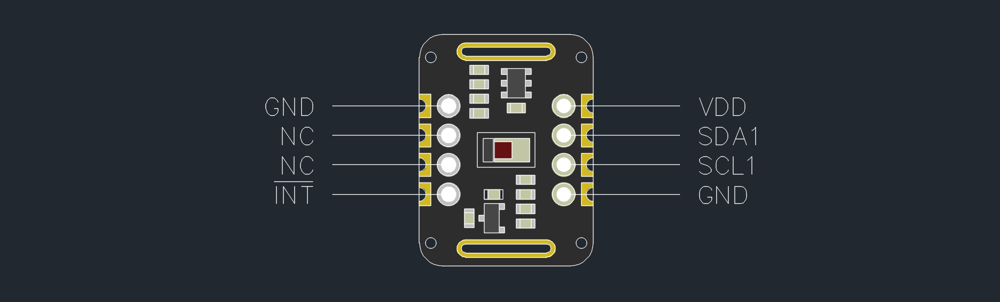

# MAX30102 STM32 HAL Driver
STM32 HAL driver for the MAX30102 pulse oximeter and heart rate sensor. 

> [!CAUTION]
> **This library is ***NOT*** intended for clinical use. Proceed at your own risk**.



## Quick start
### Minimal setup

<!--[](#known-issues)-->

### STM32CubeMX setup
* In STM32CubeMX, set I2C1 to "I2C" and USART1 to "asynchronous"
* Set up an external interrupt pin in GPIO settings, use "**external interrupt mode with falling edge trigger detection**" and "**pull-up**" settings.
* Activate the external interrupt in NVIC settings by checking the corresponding box.
* Connect the INT# pin of your MAX30102 to this external interrupt pin.
* Save and generate code.

### Main Program
#### Outside the main function
* Include `max30102_for_stm32_hal.h"`:
```c
#include "max30102_for_stm32_hal.h"
```
* If necessary, override the built-in plot function `__weak void max30102_plot(uint32_t ir_sample, uint32_t red_sample)` in the main file outside the main function:
```c
void max30102_plot(uint32_t ir_sample, uint32_t red_sample) {
  / * Insert your printing logic here * /
}
```
#### Before the superloop
* Declare an `max30102_t` object:
```c
max30102_t max30102;
```
* Initiate the `max30102_t` object and pass the corresponding I2C handle:
```c
max30102_init(&max30102, &hi2c1);
```
* Reset the sensor and clear FIFO pointers:
```c
max30102_reset(&max30102);
max30102_clear_fifo(&max30102);
```
* Set up sensor configurations:
```c
// FIFO configurations
max30102_set_fifo_config(&max30102, max30102_smp_ave_8, 1, 7);
// LED configurations
max30102_set_led_pulse_width(&max30102, max30102_spo2_16_bit);
max30102_set_adc_resolution(&max30102, max30102_spo2_adc_2048);
max30102_set_sampling_rate(&max30102, max30102_spo2_800);
max30102_set_led_current_1(&max30102, 6.2);
max30102_set_led_current_2(&max30102, 6.2);
```
* Enter measurement mode:
```c
// Enter SpO2 mode
max30102_set_mode(&max30102, max30102_spo2);
```

* Enable the required interrupts:
```c
// Enable FIFO_A_FULL interrupt
max30102_set_a_full(&max30102, 1);
// Enable die temperature measurement
max30102_set_die_temp_en(&max30102, 1);
// Enable DIE_TEMP_RDY interrupt
max30102_set_die_temp_rdy(&max30102, 1);
```
#### In the superloop
* Run interrupt handler once interrupt flag is active:
```c
while (1) {
  // If interrupt flag is active
  if (max30102_has_interrupt(&max30102))
    // Run interrupt handler to read FIFO
    max30102_interrupt_handler(&max30102);
}
```
### Interrupt
* Include `max30102_for_stm32_hal.h"`:
```c
#include "max30102_for_stm32_hal.h"
```
* Declare the `max30102_t` object as extern:
```c
extern max30102_t max30102;
```
* In the corresponding external interrupt handler function, call:
```c
max30102_on_interrupt(&max30102);
```

### Compilation
* Complie and flash program to microcontroller.
* Read the results from a serial monitor/plotter.
* Refer to [./examples](./examples) ([`main.c`](./examples/main.c), [`stm32f1xx_it.c`](./examples/stm32f1xx_it.c)) and [datasheets](https://datasheets.maximintegrated.com/en/ds/MAX30102.pdf) for further information.
